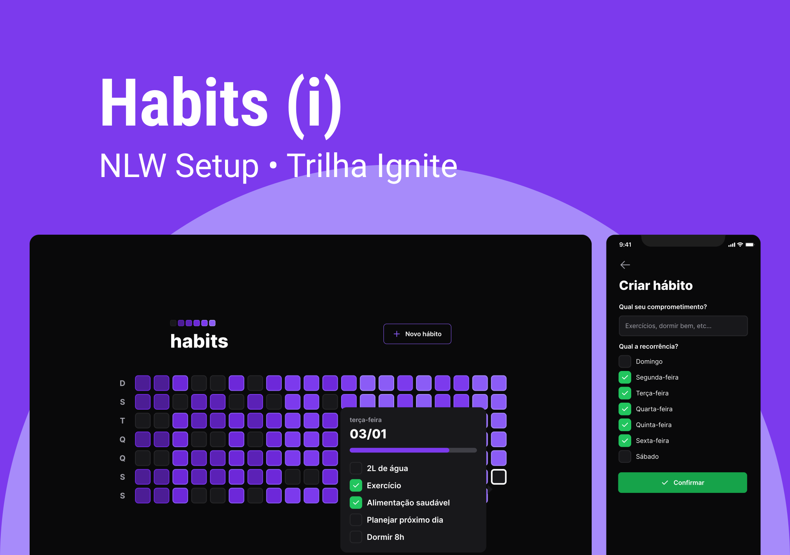

   
   
   
   
  

 

# Sobre o Projeto

 

Esse projeto foi desenvolvido durante a **NLW Setup** da trilha **Ignite**, o **NLW(Next Level Week)** é um evento produzido pela **<a href="https://rocketseat.com.br" target="_blank">Rocketseat</a>**

 

## Tecnologias

<table>
  <tbody>
    <tr>
      <td style="font-weight: bold">Front-end (web)</td>
      <td>
        <a href="https://reactjs.org/" target="_blank" rel="noopener noreferrer">React</a>,
        <a href="https://www.typescriptlang.org/" target="_blank" rel="noopener noreferrer">TypeScript</a>,
        <a href="https://vitejs.dev/" target="_blank" rel="noopener noreferrer">Vite</a>,
        <a href="https://tailwindcss.com/" target="_blank" rel="noopener noreferrer">TailwindCSS</a>
      </td>
    </tr>
    <tr>
      <td style="font-weight: bold">Back-end</td>
      <td>
        <a href="https://nodejs.org/en/" target="_blank" rel="noopener noreferrer">NodeJs</a>,
        <a href="https://www.typescriptlang.org/" target="_blank" rel="noopener noreferrer">Typescript</a>,
        <a href="https://www.prisma.io/" target="_blank" rel="noopener noreferrer">Prisma</a>,
        <a href="https://www.fastify.io/" target="_blank" rel="noopener noreferrer">Fastify</a>,
        <a href="https://www.sqlite.org/index.html" target="_blank" rel="noopener noreferrer">SQLite</a>
      </td>
    </tr>
    <tr>
      <td style="font-weight: bold">Mobile</td>
      <td>
        <a href="https://reactnative.dev/" target="_blank" rel="noopener noreferrer">React Native</a>,
        <a href="https://expo.dev/" target="_blank" rel="noopener noreferrer">Expo</a>
      </td>
    </tr>
  </tbody>
</table>
